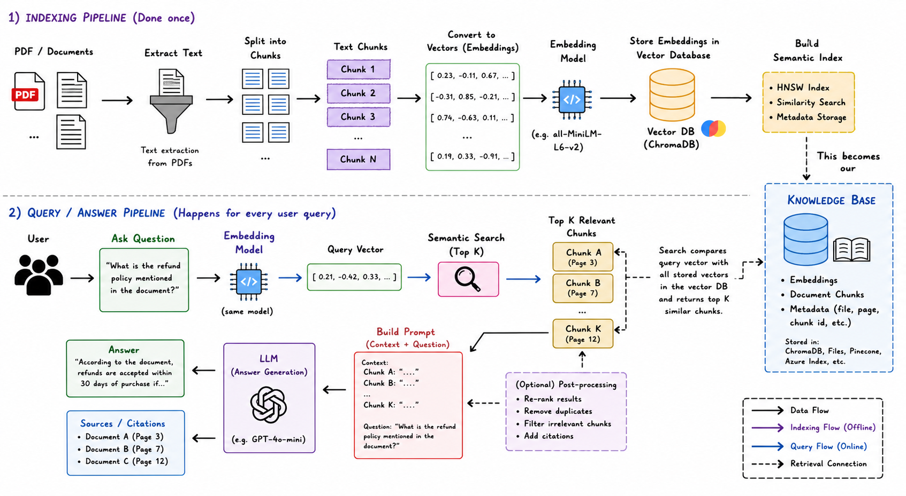

# AcquisAI

AcquisAI is a Retrieval-Augmented Generation (RAG) application that allows users to interact with EU treaties, protocols, and legal documents using natural language.

The platform combines semantic search, vector embeddings, and OpenAI-powered response generation to deliver accurate, context-aware answers grounded in uploaded documents.

Users can ask questions through a React frontend, while the FastAPI backend retrieves the most relevant document chunks from a vector database before generating a final AI response.

---

# Features

* Upload and index PDF documents
* Semantic document search using embeddings
* AI-generated contextual answers
* Source citations with page references
* FastAPI backend
* React + Vite frontend
* ChromaDB vector database integration
* Retrieval-Augmented Generation (RAG) workflow

---

# Tech Stack

## Backend

* FastAPI
* ChromaDB
* Sentence Transformers
* OpenAI API
* pdfplumber

## Frontend

* React
* Vite
* CSS

---

# RAG Architecture

This project follows a Retrieval-Augmented Generation (RAG) architecture.



## 1. Indexing Pipeline

The indexing pipeline runs once when documents are uploaded.

### Steps

1. Extract text from PDFs
2. Split text into chunks
3. Generate embeddings for each chunk
4. Store embeddings inside ChromaDB
5. Build semantic search index

---

## 2. Query Pipeline

The query pipeline runs for every user question.

### Steps

1. User submits a question
2. Question is converted into an embedding vector
3. Semantic search retrieves the most relevant chunks
4. Retrieved chunks are added into the prompt
5. OpenAI generates the grounded response
6. Sources and citations are returned

---

# Backend Setup

## 1. Navigate to Backend Folder

```bash
cd acquisai-backend
```

## 2. Create Virtual Environment

```bash
python -m venv venv
```

## 3. Activate Virtual Environment

### Windows

```bash
venv\Scripts\activate
```

### macOS / Linux

```bash
source venv/bin/activate
```

## 4. Install Dependencies

```bash
pip install -r requirements.txt
```

## 5. Configure Environment Variables

Create a `.env` file inside the backend folder:

```env
OPENAI_API_KEY=your_openai_api_key
```

## 6. Run Backend Server

```bash
uvicorn app.main:app --reload
```

Backend will run at:

```bash
http://localhost:8000
```

---

# Frontend Setup

## 1. Navigate to Frontend Folder

```bash
cd acquisai-frontend
```

## 2. Install Dependencies

```bash
npm install
```

## 3. Configure Environment Variables

Create a `.env` file inside the frontend folder:

```env
VITE_API_URL=http://localhost:8000
```

## 4. Start Frontend

```bash
npm run dev
```

Frontend will run at:

```bash
http://localhost:5173
```

---

# 🔌 API Endpoint

## Ask Question

### Endpoint

```http
POST /ask
```

### Request Body

```json
{
  "question": "What principles govern EU competences and how are they applied?"
}
```

### Response

```json
{
  "question": "What principles govern EU competences and how are they applied?",
  "answer": "The principles governing EU competences are based on the limits of powers conferred on the institutions by the Treaties,",
  "sources": [
    {
      "file_name": "EU Treaty – Protocols (Detailed Rules).pdf",
      "pages": [
        73
      ]
    },
    {
      "file_name": "EU Treaty – Main Text (Lisbon Treaty).pdf",
      "pages": [
        10,
        13,
        20
      ]
    },
    {
      "file_name": "EU Treaty – Declarations (Interpretations).pdf",
      "pages": [
        11
      ]
    }
  ]
}
```

---

# 🔍 How Retrieval Works

## Step 1: Document Processing

PDF files are processed using `pdfplumber` to extract raw text.

## Step 2: Text Chunking

Large documents are divided into smaller chunks for efficient retrieval.

## Step 3: Embedding Generation

Each chunk is converted into vector embeddings using Sentence Transformers. Chunking is important because large legal documents are too long to search or send directly to an LLM. By splitting the document into smaller parts, the system can retrieve only the most relevant sections for a user question.

### Chunking Process

1. The PDF text is extracted page by page.
2. The extracted text is cleaned by removing extra spaces, line breaks, and empty content.
3. The text is divided into smaller chunks.
4. Each chunk keeps metadata such as:
   - Source file name
   - Page number
   - Chunk ID

## Step 4: Vector Storage

Embeddings are stored inside ChromaDB.

## Step 5: Semantic Retrieval

User query embeddings are compared against stored vectors.

## Step 6: Response Generation

Relevant chunks are injected into the prompt before sending to OpenAI.

---

# Sample Questions for Testing

Use the following example questions to test the RAG pipeline and semantic retrieval system:

```text
What rights are recognized by the Union under Article 6?

What principles govern EU competences and how are they applied?

How does the EU balance powers between Member States and itself?

What is stated about human dignity in the treaty?

Explain proportionality in the EU context.

```

---

# License

This project is intended for educational and research purposes.

---